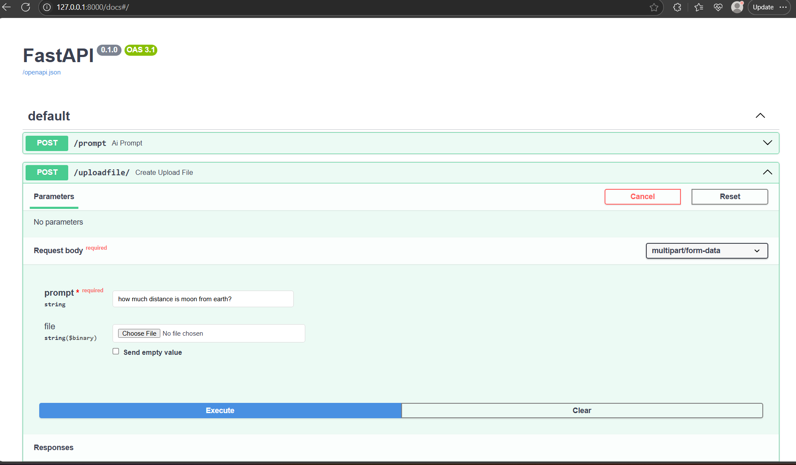

# AI_Chat_API

OpenAI API based Chat API, where the users can query through text or upload an image and query a question releated to that image.

# Getting started in local

fastapi dev chatpi.py

# Swagger documentation

http://127.0.0.1:8000/docs#/

# Reference screenshot

